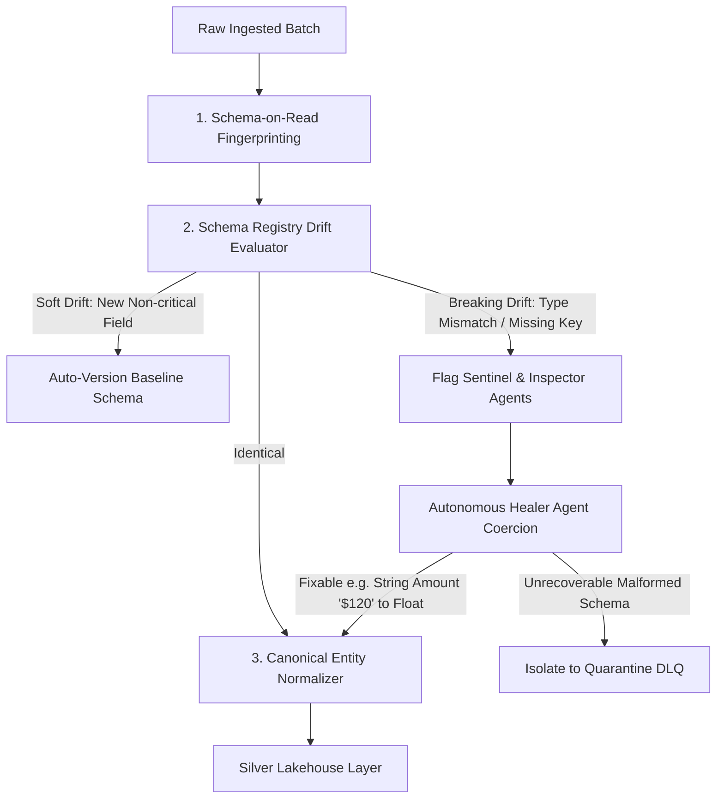

# 🔭 Next-Gen Agentic Data Platform Observability

[](https://opensource.org/licenses/MIT)
[](https://nodejs.org)
[](https://www.dynatrace.com)
[](https://www.datadoghq.com)
[](https://www.databricks.com)
[](#medallion-lakehouse-architecture)

> **Enterprise-grade, AI-powered autonomous observability platform purpose-built for the Data Layer.**  
> Built to monitor, protect, and self-heal modern data pipelines (Airflow DAGs, Kafka topics, Databricks Delta Lake, dbt models, Snowflake data marts) using an autonomous **5-member multi-agent swarm**, **Dynatrace Davis AI causal analysis**, and **Datadog Data Observability telemetry**.

---

## 📌 Executive Summary & Core Mission

### ❌ What This Is NOT
* **NOT** Server or Infrastructure Monitoring (CPU, RAM, disk space, VM uptime).
* **NOT** Application Performance Monitoring (APM for web HTTP requests, browser clicks).
* **NOT** Hardware Monitoring (temperatures, network switches, cooling fans).

### ✅ What This IS
* **Pipeline Health & DAG Topology**: Real-time status, latency, duration, and blast radius across every ETL/ELT node.
* **Data Quality & Contract Enforcement**: Great Expectations-style checks (null checks, unique keys, valid ranges).
* **Data Freshness & SLA Tracking**: Ingestion lag monitoring from streaming and batch sources.
* **Schema Drift & Evolution Management**: Dynamic fingerprinting, breaking vs. soft drift categorization, and type coercion.
* **Autonomous Remediation**: AI agents that quarantine poisoned records into Dead Letter Queues (DLQ) and dynamically repair schemas without human intervention.
* **FinOps & Cloud Cost Governance**: Real-time detection of runaway query scans, unpartitioned jobs, and Databricks DBU / Snowflake credit spikes.

---

## 🏗️ Architecture Blueprint

```
┌────────────────────────────────────────────────────────────────────────────────────────────────────────┐
│                        AI-POWERED AGENTIC DATA PLATFORM OBSERVABILITY                                   │
└────────────────────────────────────────────────────────────────────────────────────────────────────────┘
                                                    │
                ┌───────────────────────────────────┴───────────────────────────────────┐
                ▼                                                                       ▼
┌──────────────────────────────────────────────┐       ┌────────────────────────────────────────────────┐
│   1. MULTI-SOURCE INGESTION & DATA LAKE      │       │   2. SCHEMA REGISTRY & EVOLUTION MANAGER       │
│  - Public APIs (Live e-commerce/financial)   │──────▶│  - Schema-on-Read Fingerprinting (MD5 hash)    │
│  - Synthetic Stream Generator                │       │  - Schema Drift Detection (Breaking vs Soft)   │
│  - Databricks Auto Loader & Bronze Delta     │       │  - Canonical Entity Mapping & Type Normalizer  │
│  - Quarantine Zone / Dead Letter Queue (DLQ) │       │  - Data Quality Contracts (Great Expectations) │
└──────────────────────────────────────────────┘       └────────────────────────────────────────────────┘
                        │                                                       │
                        ▼                                                       ▼
┌───────────────────────────────────────────────────────────────────────────────────────────────────────┐
│                           3. PIPELINE DAG & METADATA GRAPH ENGINE                                     │
│  - Directed Acyclic Graph (DAG) state: Source ➔ Bronze ➔ Silver Cleanse ➔ Gold Mart ➔ BI / ML         │
│  - Graph Lineage Tracker (Forward blast radius & backward root cause tracing)                         │
│  - Execution runtime metrics: duration_ms, row_count, null_rate, freshness_lag, query_cost_usd        │
└───────────────────────────────────────────────────────────────────────────────────────────────────────┘
                                                    │
                                                    ▼
┌───────────────────────────────────────────────────────────────────────────────────────────────────────┐
│                      4. AUTONOMOUS 5-AGENT MULTI-AGENT SWARM (AGENTIC LAYER)                          │
│                                                                                                       │
│  ┌───────────────────────┐  ┌───────────────────────┐  ┌───────────────────────┐                      │
│  │  Agent 1: Sentinel    │  │  Agent 2: Inspector   │  │   Agent 3: Healer     │                      │
│  │ (Anomaly & Quality)   │  │ (DAG Root Cause Davis)│  │ (Autonomous Remed.)   │                      │
│  └───────────────────────┘  └───────────────────────┘  └───────────────────────┘                      │
│  ┌───────────────────────┐  ┌───────────────────────┐                                                 │
│  │  Agent 4: FinOps      │  │  Agent 5: Copilot     │                                                 │
│  │ (Cloud Cost & SLA)    │  │ (Natural Language NLQ)│                                                 │
│  └───────────────────────┘  └───────────────────────┘                                                 │
└───────────────────────────────────────────────────────────────────────────────────────────────────────┘
                                                    │
                ┌───────────────────────────────────┴───────────────────────────────────┐
                ▼                                                                       ▼
┌──────────────────────────────────────────────┐       ┌────────────────────────────────────────────────┐
│       5. DYNATRACE DAVIS AI CONNECTOR        │       │         6. DATADOG DATA OBSERVABILITY          │
│  - Davis AI Causal Topology (Smartscape DAG) │       │  - OpenTelemetry Trace & Span Emitter          │
│  - Davis Root Cause Problem generation       │       │  - Data Freshness, Volume & Quality Metrics    │
│  - Event Ingestion API (Availability/Anom)   │       │  - Bits AI Prompt / Incident Webhook Sync      │
│  - Auto-remediation trigger integration      │       │  - Service Catalog for Data Assets & Pipelines │
└──────────────────────────────────────────────┘       └────────────────────────────────────────────────┘
                                                    │
                                                    ▼
┌───────────────────────────────────────────────────────────────────────────────────────────────────────┐
│                       7. ENTERPRISE OBSERVABILITY COMMAND CENTER (FRONTEND)                           │
│  - Interactive Pipeline DAG Canvas with Real-Time Health & Node Telemetry                             │
│  - Schema Evolution & Drift Inspector (Side-by-side diffs, Bronze➔Silver mapping)                     │
│  - Dynatrace Davis & Datadog Live Telemetry Streams & Exporter Status                                 │
│  - Autonomous Agent Operation Terminal (live reasoning chains & remediation executions)               │
│  - AI Copilot Natural Language Investigation Console (Ask "Why did pipeline fail?")                   │
│  - Data Lake Explorer (Bronze raw files, Silver clean datasets, Quarantine DLQ)                       │
│  - Synthetic Chaos & Live Pipeline Injector (Trigger schema drift, null spike, SLA lag, cost anomaly) │
└───────────────────────────────────────────────────────────────────────────────────────────────────────┘
```

---

## 🗄️ Medallion Lakehouse Architecture

Data flows through 4 distinct tiers on disk (`storage/lakehouse/`):

```
[Kafka Streams / CRM Postgres / Web APIs]
                     │
                     ▼
  ┌──────────────────────────────────────────────┐
  │ 1. BRONZE TIER (storage/lakehouse/bronze/)   │  <-- RAW LANDING ZONE
  │ - Untouched, immutable raw payloads          │
  │ - Ingestion metadata envelope (UUID, hash)   │
  └──────────────────────┬───────────────────────┘
                         │
                         ▼
  ┌──────────────────────────────────────────────┐     ┌─────────────────────────────────────────┐
  │ 2. SILVER TIER (storage/lakehouse/silver/)   │     │ 4. QUARANTINE DLQ (lakehouse/quarantine)│
  │ - Validated by Data Contracts (Quality >80%) │     │ - Poisoned records isolated here        │
  │ - Canonical entity normalization             │ ──▶ │ - Prevents corrupted data reaching Gold │
  └──────────────────────┬───────────────────────┘     └─────────────────────────────────────────┘
                         │
                         ▼
  ┌──────────────────────────────────────────────┐
  │ 3. GOLD TIER   (storage/lakehouse/gold/)     │  <-- CURATED BUSINESS MARTS
  │ - Aggregated tables for BI & AI/ML Models    │
  └──────────────────────────────────────────────┘
```

1. **Bronze Tier (Raw Landing)**: Immutable ingestion envelopes storing incoming payloads with timestamps, batch IDs, and structural hashes.
2. **Silver Tier (Standardized & Cleansed)**: Validated data conformant with Data Contracts, normalized to canonical enterprise entities.
3. **Gold Tier (Curated Business Marts)**: Aggregated high-value business tables (`gold_customer_360`, `gold_financial_reconciliation`) feeding BI dashboards and ML feature stores.
4. **Quarantine (Dead Letter Queue - DLQ)**: Poisoned rows that fail contract checks are isolated here with full diagnostic reasons, shielding downstream dashboards.

---

## 📐 Schema Management & Drift Handling

Heterogeneous and evolving schemas are handled via a 4-step pipeline:



* **Schema-on-Read Fingerprinting**: Dynamically extracts column names, inferred types, nullability rates, and calculates an MD5 fingerprint hash.
* **Drift Categorization**:
  * **Soft Drift**: New optional fields added (safe, auto-versioned in registry).
  * **Breaking Drift**: Dropped mandatory fields or mutated types (e.g., float amount arrives as string `"$120.50"`).
* **Canonical Mapping**: Unifies disparate naming conventions (e.g., `user_legacy_guid` and `customer_id` map to `canonical_customer_id`).
* **Autonomous Remediation**: Coerces recoverable formats in flight; diverts unrecoverable corrupted rows to DLQ.

---

## 🤖 The 5-Member Autonomous Multi-Agent Swarm

```
┌────────────────────────────────────────────────────────────────────────────────┐
│                          5-MEMBER AUTONOMOUS MULTI-AGENT SWARM                 │
│                                                                                │
│  🔍 Sentinel (Agent 1)  ──▶ Scans for anomalies in quality, schema, SLA, cost │
│  🌳 Inspector (Agent 2) ──▶ Traces Davis AI root cause & downstream blast     │
│  🔧 Healer (Agent 3)    ──▶ Auto-quarantines bad rows, type casts, resolves    │
│  💰 FinOps (Agent 4)    ──▶ Identifies unpartitioned queries & Snowflake surge │
│  💬 Copilot (Agent 5)   ──▶ Answers engineer queries in natural language       │
└────────────────────────────────────────────────────────────────────────────────┘
```

| Agent | Role | Responsibility |
| :--- | :--- | :--- |
| **🔍 Sentinel** | Data Quality & Anomaly Detector | Evaluates statistical distributions across row volume, null surges, schema drift, and SLA latency. Emits telemetry to Datadog. |
| **🌳 Inspector** | Root Cause & Lineage Tracer | Traverses the DAG backward from failing nodes to isolate root causes. Emits causal graphs and registers incidents with Dynatrace Davis AI. |
| **🔧 Healer** | Autonomous Auto-Remediation | Executes playbooks: circuit-breaker quarantine to DLQ, dynamic schema casting, micro-batch backfills, and problem resolution. |
| **💰 FinOps** | Cloud Cost & SLA Optimizer | Watches query costs, unpartitioned table scans, and cluster usage (Snowflake credits / Databricks DBUs). |
| **💬 Copilot** | Natural Language Investigator | Conversational assistant answering queries like *"Why did the pipeline fail?"* or *"Show quarantine status"*. |

---

## 📡 Dynatrace & Datadog Telemetry Integration

| Feature | Dynatrace Davis AI Integration | Datadog Observability Integration |
| :--- | :--- | :--- |
| **Topology** | **Smartscape Dependency Mapping**: Maps Data Pipelines, Lakehouse tiers, and Data Marts as monitored entities (`DATA_ASSET`, `SERVICE`). | **Datadog Service Catalog**: Tracks pipeline nodes (`pipeline.step.*`). |
| **Causal AI** | **Davis AI Root Cause Problems**: Traverses the pipeline graph to detect causal paths (`DAVIS-P-XXXXX`) and auto-resolves them when the Healer agent fixes the issue. | **Bits AI Incident Feed**: Emits critical alerts and monitor events for sudden quality collapses. |
| **Tracing** | **Distributed Context Propagation**: Tracks data asset dependencies through OpenPipeline. | **OpenTelemetry APM Traces**: Emits standard OTel trace spans (`trace_id`, `span_id`, duration, data quality tags). |
| **Metrics** | Real-time SLA breach & dependency health tracking. | **Data Observability Metrics**: `data.observability.quality.score`, `data.observability.freshness.seconds`, and cost gauges. |

---

## 🚀 Quickstart & Installation

### Prerequisites
* **Node.js** v20.0.0 or higher
* **npm** v9.0.0 or higher

### 1. Clone & Install
```bash
git clone https://github.com/your-org/agentic-data-observability.git
cd agentic-data-observability
npm install
```

### 2. Start the Platform
```bash
npm start
```
The server will initialize the Medallion lakehouse directories, execute an initial healthy pipeline run, and spin up the Command Center UI:
```
Agentic Data Platform Observability running at http://localhost:3000
Initial healthy pipeline execution completed.
```

### 3. Open the Command Center
Navigate your browser to:
👉 **`http://localhost:3000`**

---

## 🧪 Interactive Demo & Chaos Testing

You can test the autonomous multi-agent reaction directly from the Command Center UI:

1. **Healthy Run**: Click **`⚡ Run Pipeline`** to execute a normal batch. All nodes show green, Quality Score > 98%.
2. **Inject Chaos**: In the top-right dropdown, select:
   * **`💥 Inject: Schema Drift (Breaking)`**: Corrupts transaction amounts from numbers into formatted strings (`"$120.50"`).
   * **`💥 Inject: Null Value Surge`**: Injects 50%+ null values into mandatory email and currency columns.
   * **`💥 Inject: 14x Snowflake Cost Spike`**: Simulates an unpartitioned table scan consuming runaway credits.
3. **Observe Autonomous Swarm Reaction**:
   * **Sentinel** catches the anomaly within milliseconds.
   * **Inspector** traces the upstream source and calculates downstream blast radius.
   * **Healer** isolates corrupted records into Quarantine DLQ, shielding downstream Executive Dashboards.
   * **Dynatrace & Datadog** record the problem, trace the span, and mark the incident resolved upon healing.
4. **Chat with Copilot**: Switch to the **AI Copilot tab (`💬`)** and ask:  
   *"Why did the pipeline fail last run?"*

---

## 📁 Repository Structure

```
agentic-data-observability/
├── public/
│   └── index.html                # Enterprise Command Center UI (Tailwind CSS, DAG Canvas)
├── src/
│   ├── data-lake/
│   │   ├── lakehouse.js          # Medallion Storage Manager (Bronze, Silver, Gold, DLQ)
│   │   └── data-generator.js     # Synthetic Enterprise Stream & Internet Web API Ingestor
│   ├── schema-engine/
│   │   ├── schema-registry.js    # Schema-on-Read Fingerprinting & Drift Evaluation
│   │   └── data-contracts.js     # Data Quality Contracts (Great Expectations style)
│   ├── dag-engine/
│   │   ├── dag-orchestrator.js   # Pipeline DAG Flow Orchestrator & Node State Tracker
│   │   └── lineage-tracker.js    # Forward Blast Radius & Backward Root Cause Tracer
│   ├── telemetry/
│   │   ├── datadog-connector.js  # Datadog Metrics, OTel Spans & Event Feeds
│   │   └── dynatrace-connector.js# Dynatrace Smartscape Topology & Davis AI Problem Engine
│   ├── agents/
│   │   └── agent-swarm.js        # 5-Agent Swarm (Sentinel, Inspector, Healer, FinOps, Copilot)
│   └── server.js                 # Express API & Static Server
├── storage/
│   └── lakehouse/
│       ├── bronze/               # Raw Landing Envelopes (.json)
│       ├── silver/               # Cleansed Canonical Datasets (.json)
│       ├── gold/                 # Curated Business Marts (.json)
│       └── quarantine/           # Dead Letter Queue (DLQ) Rejected Records (.json)
├── package.json
└── README.md
```

---

## 🔌 REST API Reference

| Endpoint | Method | Description |
| :--- | :--- | :--- |
| `/api/dag` | `GET` | Returns current DAG nodes, dependencies, states, and telemetry. |
| `/api/lakehouse` | `GET` | Returns Lakehouse file counts and recent batch files across all tiers. |
| `/api/schema` | `GET` | Returns registered canonical baselines and history of schema drift events. |
| `/api/telemetry/datadog` | `GET` | Returns Datadog metric buffers, OpenTelemetry trace spans, and events. |
| `/api/telemetry/dynatrace` | `GET` | Returns Dynatrace Smartscape entities and Davis AI causal problems. |
| `/api/agents/logs` | `GET` | Returns live operation and remediation logs from the 5 agents. |
| `/api/pipeline/run` | `POST` | Executes an end-to-end pipeline batch and triggers the agent swarm loop. |
| `/api/chaos/inject` | `POST` | Injects on-demand chaos scenarios (`SCHEMA_DRIFT`, `NULL_SURGE`, `CLEAR`). |
| `/api/ingest/internet` | `POST` | Fetches live public web API datasets into the Bronze Lakehouse. |
| `/api/copilot/chat` | `POST` | Natural language question-and-answer endpoint for the AI Copilot. |

---

## 📄 License

This project is licensed under the MIT License - see the [LICENSE](LICENSE) file for details.
